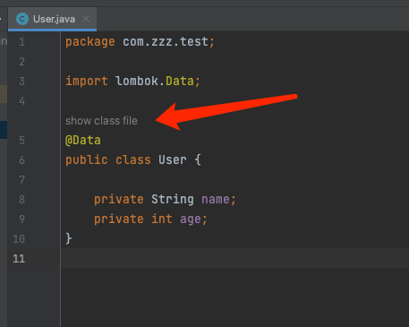

# Lombok-Helper

## Intro

Take a quick look at the compilation file

## Install

Execute the plugin `buildPlugin` which provided by IntelliJ in Gradle, and you can find zip file in directory `build/distributions`.

## References

- [x]  [com.intellij.codeBlockProvider](https://plugins.jetbrains.com/docs/intellij/extension-point-list.html#designerxml)
- [x] [Code Vision Provider](https://plugins.jetbrains.com/docs/intellij/inlay-hints.html#code-vision-provider)
- [x] [JavaReferencesCodeVisionProvider](https://github.com/JetBrains/intellij-community/blob/627cdfebf746e7ec4159830c490566e7c85586de/java/java-impl/src/com/intellij/codeInsight/daemon/impl/JavaReferencesCodeVisionProvider.kt#L14)
- [x] [Module](https://plugins.jetbrains.com/docs/intellij/module.html)
- [x] [Virtual Files](https://plugins.jetbrains.com/docs/intellij/virtual-file.html)
- [ ]  ~~https://plugins.jetbrains.com/docs/intellij/line-marker-provider.html~~

## Todo List

- [ ] 点击查看class文件时等待编译文件生成之后再进行展示。 等待PromiseResult目前遇到问题,现在点击show class file之后要等编译完成之后再点击一次。
- [ ] 点击查看class文件时关闭之前的窗口或者自定义展示窗口？
- [ ] 如果不存在class文件则自动生成——能否优化？能不能直接拿到class虚拟文件？
- [ ] ~~判断是否使用lombok注解~~